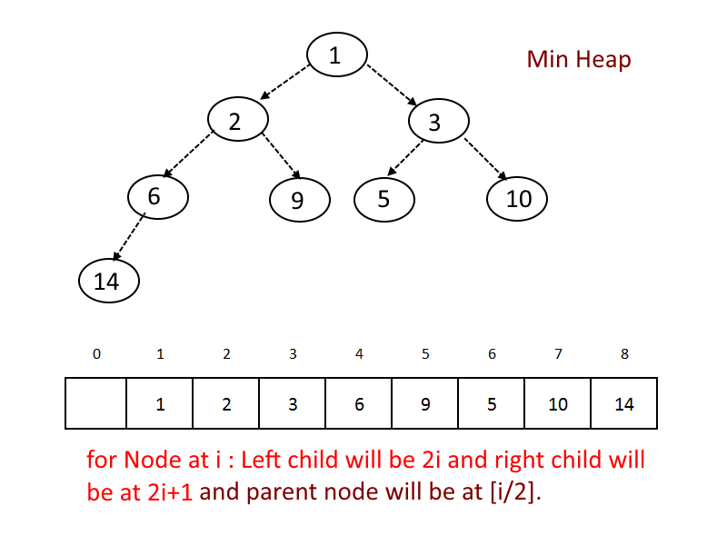

# WordRecurrence
AEDS II | CEFET-MG

    
 
 
</a> 

 

 

## Proposta de Projeto
Esse projeto tem como proposta a leitura de múltiplos arquivos de texto (`.txt`) e a análise da recorrência de palavras ao longo de todos os textos.
Existem algumas regras para a análise textual ser feita corretamente:
- É necessário usar uma estrutura `HASH` para o armazenamento das palavras.
  - São consideradas palavras apenas aquelas que possuem todos os caracteres presentes na tabela `ASCII`.
  - Sinais de pontuação são removidos antes da análise de palavras.
- A recorrência deve ser feita utilizando uma estrutura `HEAP`.
- As `N` palavras mais recorrentes devem ser exibidas no terminal ao fim da execução.
- Existe um arquivo chamado `stopwords.csv` que contém palavras consideradas como *stopwords*, elas não devem ser consideradas como palavras à serem analisadas as recorrências. Caso fossem consideradas como palavras comuns, elas iriam ser as que mais apareceriam nos textos.

|          Sinais de pontuação  | Stop words                                      |
|-------------------------------|-------------------------------------------------|
| `.`,   `!`,   `?`                   |   `artigos(a, o, as,os), conjunções(e, ou), palavras comuns (aquela, estiver) `  |

## Arquivos e funções
O projeto é dividido entre três arquivos de códigos própriamente ditos: `leitura.hpp`, `leitura.cpp` e `main.cpp`.

|  Arquivo                        |   Função                                                                                          |
| ------------------------------- | ------------------------------------------------------------------------------------------------- |
|  `main.cpp`                       | Arquivo principal para iniciar e chamar as funções do código                                                    |
|  `leitura.hpp`                  | Define as funções e as estruturas que foram utilizadas no código |
|  `leitura.cpp`                  | Contém o escopo de todas as funções que foram utilizadas |
| `stopwords.csv` | arquivo que contem as stop words|
| `arquivo_de_leitura.txt` | um dos arquivos de entrada principal no qual será feita toda a análise |

> O arquivo `main.cpp` "chama" apenas uma função definida no `leitura.hpp` e processada no `leitura.cpp`, chamada `readPrincipal()`. Ela, por sua vez, organiza todo o processo e as demais funções presentes no projeto. 

## Lógica Implementada

Como foi dito anteriormente, apenas a função `readPrincipal()` é "chamada" na *main.cpp*. Tal função começa inicializando as variáveis necessárias para o funcionamento do código. Além das variáveis consideradas "comuns", como as do tipo *int*, *bool* e *string*, uma struct chamada `palavra_q` armazena a quantidade de cada palavra nos arquivos de texto.
Logo em seguida, uma estrutura é apresentada no código, chamada `unordered_map`, seu funcionamento de baseia em uma tabela HASH.
- `unordered_map` é uma classe da biblioteca padrão do C++ que implementa uma estrutura de dados de tabela hash. Ela funciona como um armazenamento associativo e é utilizada para alocar pares chave-valor, onde cada chave é única e mapeia para um único valor. Essa estrutura se diferencia de um `map` na característica de que a primeira não ordena os elementos, diferentemente da segunda.
- Na situação apresentada, a tabela hash funciona como armazenamento de palavras e também a sua recorrência dentro dos arquivos de texto. Por possuir um tempo de acesso constante *(O(1))*, o extenso número de palavras dos textos não compromete a execução que pode ser feita em um tempo médio relativamente baixo, considerando a massa de dados.

    
    <figcaption><h6>Exemplo de funcionamento da tabela HASH por trás de uma estrutura unordered_map.<h6></figcaption>

Partindo para o funcionamento do programa, um *vector* armazena o nome dos arquivos de texto que serão lidos, e seu tamanho irá coordenar quantas vezes uma estrutura `for` irá repetir (cada repetição processa um arquivo de texto).
Caso o arquivo de texto tenha sido aberto corretamente, o processamento do texto finalmente iniciará. Enquanto houverem linhas no arquivo de texto, os seguintes passos serão seguidos acompanhados das suas respectivas funções, linha por linha:
- Todas as letras de todas as palavras serão transformadas em *minúsculas* utilizando o comando `tolower()`, além disso as letras acentuadas também serão transformadas em *minúsculas* (`converterAcentuadasParaMinusculas()`).
- As possíveis reticências presentes na linha também serão retiradas (`tiraReticencia()`).
- Caso exista um número na linha, uma estrutura condicional *if*, juntamente com a função `temNumero()`, impede que esse número seja adicionado à tabela hash.
- Existem também funções que verificam a presença de algum caractere que não seja uma letra na palavra (`Pontuacao()`, `removePontuacao()`). Caso essa verificação encontre algum caractere indesejado, eles são removidos.
- Também é necessária a verificação da possibilidade da palavra a ser adicionada à tabela hash ser uma *stop word*, presente no arquivo *stopwords.csv*. Tal ferificação se dá utilizando uma estrutura chamada `.find()`. A função *.find()* em C++ é usada para buscar a primeira ocorrência de um valor ou substring em uma string ou sequência de caracteres. Caso seja uma stop word, essa palavra não é adicionada à tabela hash.
- Uma última verificação é feita antes da adição à tabela hash. Ela serve para excluir caracteres fora da tabela *ASCII*. Caracteres que não estão presentes nessa tabela não são trabalhados de maneira correta pelo C++, então palavras com tais caracteres não são adicionadas à tabela.
- Por fim, caso todas as condições acima tenham sido ultrapassadas, a palavra pode ser adicionada à tabela hash através da função `inserePrintGeral()`.
  - A função acima verifica se a palavra a ser adicionada já existe na tabela, caso ela já existir, é incrementada sua quantidade.

Após a leitura e processamento de dados de todos os arquivos de texto, é acionada a última função, chamada `calcula_heap()`.
> A função heap serve, no algorítmo, para "separar" as palavras mais recorrentes no texto. A partir do momento que todas as palavras já estão inseridas na tabela hash, juntamente com suas respectivas quantidades, a heap pode ser executada. O programa faz uma *minheap*.

A estrutura `HEAP` (função *calcula_a_heap()*) funciona da seguinte forma:
- É percorrida todas as posições presentes no *unordered_map*, cada posição sofre a verificação em relação à quantidade.
- Os *K* primeiros elementos são inseridos na heap e, posteriormente, a estrutura chamada `binary min_heap` é feita.
  - Uma min heap (ou min-heap) é uma estrutura de dados de árvore binária completa que possui a propriedade de que o valor de cada nó é menor ou igual aos valores de seus filhos. Em outras palavras, o nó pai é sempre menor ou igual aos seus nós filhos.

    
    <figcaption><h6>Exemplo de apresentação de uma árvore binária "min_heap"<h6></figcaption>

      
- A partir da posição *K+1*, a quantidade armazenada na posição da *hash* é comparada com a quantidade armazenada no elemento de primeiro nível na *heap*. Caso a nova quantidade seja maior, é feita a troca e a estrutura *min_heap* é novamente acionada para colocar o menor elemento presente no primeiro nível da árvore.

Assim, ao final da verificação por toda a *hash*, os *K* elementos presentes na árvore binária *min_heap* serão as palavras mais recorrentes nos dois textos.

## Testes Realizados
- Os testes que serão apresentados abaixo foram feitos em um Notebook Acer Nitro 5 (intel i5 10300H - gtx 1650 - 8gb ram).

|  Arquivos                       |   Quantidade Individual de Palavras | Quantidade total de palavras em todos os textos |
| ------------------------------- | ------------------------------ | ---------------------- |
|  `DomCasmurro.txt`                       | 9152 | 28047 |
| `Semana_Machado_Assis.txt` | 25021 | --------------- |

> Os testes foram feitos utilizando um *K* igual á 20. Definido por `#define K 20`

    
    <figcaption><h6>Exemplo de saída do terminal à partir de K=20 (20 palavras mais recorrentes)<h6></figcaption>

Como pode-se observar na imagem acima, essas são as 20 palavras mais recorrentes nos dois textos analizados (não apresentam ordenação).
> Caso seja necessária a observação de um maior ou menor número de palavras mais recorrentes, é necessária apenas a mudança do valor de *K*.

## Conclusão

Portanto, o algorítmo apresentado combina de forma eficiente a utilização das estruturas `HASH TABLE` e `MIN HEAP`. Para contar os elementos nos arquivos de texto lidos, o custo computacional é *O(nlogK)*, onde *n* é o tamanho da coleção e *K* o número de elementos desejado como saída.
- Caso fosse necessária a ordenação dos *K* elementos finais, o custo computacional seria aumentado consideravelmente, assim como o tempo de execução.
- O êxito na execução só foi possível devido á boa combinação entre as estruturas `unordered_map` (padrão da biblioteca do C++) e a `min_heap` (implementada). Seus relativamente baixos custos computacionais fazem com que uma densa massa de dados seja processada em poucos segundos, extraíndo todas as informações necessárias de cada elemento.
> A implementação manual de uma *min_heap* demandou um estudo aprofundado e fundamental para a compreensão de técnicas de programação e lógica programacional. Mesmo já possuindo uma estrutura pronta (*unordered_map*), um estudo sobre *hash table* também foi feito para compreender como essa estrutura funciona.

## Compilação e Execução
Esse exemplo possui um arquivo Makefile que realiza todo o procedimento de compilação e execução. Para tanto, temos as seguintes diretrizes de execução:

| Comando                |  Função                                                                                           |
| -----------------------| ------------------------------------------------------------------------------------------------- |
|  `make clean`          | Apaga a última compilação realizada contida na pasta build                                        |
|  `make`                | Executa a compilação do programa utilizando o gcc, e o resultado vai para a pasta build           |
|  `make run`            | Executa o programa da pasta build após a realização da compilação                                 |

 

#### Felipe Parreiras

